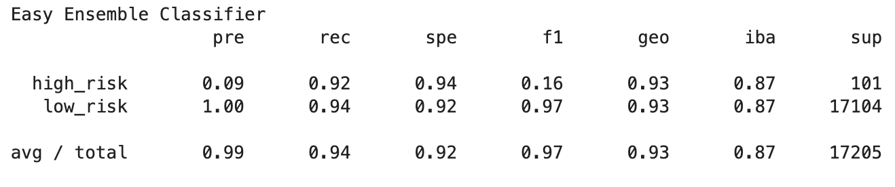

# Credit_Risk_Analysis

# Overview of the project:
Credit risk is an inherently unbalanced classification problem, as good loans easily outnumber risky loans, as the dataset we use in this project. So we will need to use different techniques to train and evaluate models with unbalanced classes. In this project, we will use a few different models including RandomOverSampler, SMOTE, ClusterCentroids, and SMOTEENN algorithms, and compare the results.

We will also use two other machine learning models, BalanceRandomForestClassifier and EasyEnsembleClassifier to reduce bias and predict the credit risk.

# Results
- First, I try the logistic regression classifier model without modifying the sample:  
  Accuracy score: 0.99  
  Precision: high_risk: 0.81, low_risk: 1.00  
  Recall: high_risk: 0.21, low_risk: 1.00  
  F1 score: high_risk: 0.33, low_risk: 1.00  
  
- Oversampling with RandomOverSampler:  
  Balanced Accuracy Score: 0.84  
  Precision: high_risk: 0.03, low_risk: 1.00  
  Recall: high_risk: 0.82, low_risk: 0.84  
  F1 score: high_risk: 0.06, low_risk: 0.91  
  
- Oversampling with SMOTE:  
  Balanced Accuracy Score: 0.87  
  Precision: high_risk: 0.04, low_risk: 1.00  
  Recall: high_risk: 0.82, low_risk: 0.87  
  F1 score: high_risk: 0.07, low_risk: 0.93  
  
- Undrsampling with ClusterCentroids:  
  Balanced Accuracy Score: 0.76  
  Precision: high_risk: 0.02, low_risk: 1.00  
  Recall: high_risk: 0.88, low_risk: 0.76  
  F1 score: high_risk: 0.04, low_risk: 0.86  
  
  
  
- Combination sampling with SMOTEENN:  
  Balanced Accuracy Score: 0.84  
  Precision: high_risk: 0.03, low_risk: 1.00  
  Recall: high_risk: 0.83, low_risk: 0.86  
  F1 score: high_risk: 0.06, low_risk: 0.92  
  
  

- With BalancedRandomForestClassifier:
  Balanced Accuracy Score: 0.75  
  Precision: high_risk: 0.03, low_risk: 1.00  
  Recall: high_risk: 0.63, low_risk: 0.88  
  F1 score: high_risk: 0.06, low_risk: 0.94  
  
  
  
- With EasyEnsembleClassifier:
  Balanced Accuracy Score: 0.93  
  Precision: high_risk: 0.09, low_risk: 1.00  
  Recall: high_risk: 0.92, low_risk: 0.94  
  F1 score: high_risk: 0.16, low_risk: 0.97  
  
    
  
- Imbalanced Classification Reports for each model:  
    
    
    
    
  
# Summary
In this case, because the low-risk cases are the majority class, and the goal of this project is to predict the high-risk cases, so we will focus on the score for high-risk prediction.

When we use the logistic regression model without modifying the sample number, we have a great accuracy score of 0.99, but because of the imbalanced classes, the recall for high-risk prediction is only 0.21, meaning there's a good chance that the model will not successfully predict a high-risk applicant. In this credit risk case, we want to be able to find high-risk cases, therefore, this algorithm might not be the best fit for this case.

Next is the oversampling with the RandomOverSampler algorithm, we got an accuracy score of 0.83, high-risk precision is 0.03 which is much lower, F1 score of 0.06, but look at the recall score which is 0.82, it is much higher than the previous algorithm, meaning it could have more false positive cases with this algorithm, which isn't perfect but from the business standpoint, we will rather screen out the true positive and false positive and have a closer look with those cases.

SMOTE oversampling, we have an accuracy of 0.84, high-risk precision is 0.04, F1 score of 0.07, and recall score of 0.82. The result is very close to RandomOverSampler, so we can see those two algorithms result in the same for this case.

Undersampling with ClusterCentroids, we have an accuracy score of 0.82, a high-risk precision score of 0.02, an F1 score of 0.04, and a recall of 0.88. From the scores, we can also see that this will yield a higher false positive, even higher than the last two oversampling algorithms. But for the big picture, this result will be in the same category as the two oversampling algorithms.

Combining sampling with SMOTEENN, we have an accuracy score of 0.84, high-risk precision of 0.03, F1 score of 0.06, and recall of 0.83. It is also very close to the other resampling methods, which will have higher sensitivity (recall) and will have more false positive cases.

Next, we will look at the BalancedRandomForestClassifier algorithm, we have an accuracy score of 0.76, high-risk precision of 0.03, an F1 score of 0.06, and a recall of 0.63. With the lower accuracy score, precision, and recall, this model will more likely yield more false negative cases, which is the high-risk cases but the model predicted as low-risk cases. So this model will not be a good choice for this credit risk prediction case.

Last we have EasyEnsembleClassifier, with this model we have an accuracy score of 0.93, higher scores for high-risk precision (0.09), recall (0.92), and F1 score (0.16). This result looks more promising than the other models. It will most likely have better chances to predict a true positive, and a better chance to better screen out the false positive, which will be good for this case.

In summary, the EasyEnsembleClassifier will be a better choice for this credit risk case. Higher precision and recall scores mean it has a better chance to screen out true and false positives while lowering the chance to predict false negatives, which will be good for the business since the lower false positives can mean less labor will need to be involved to do further investigation.
